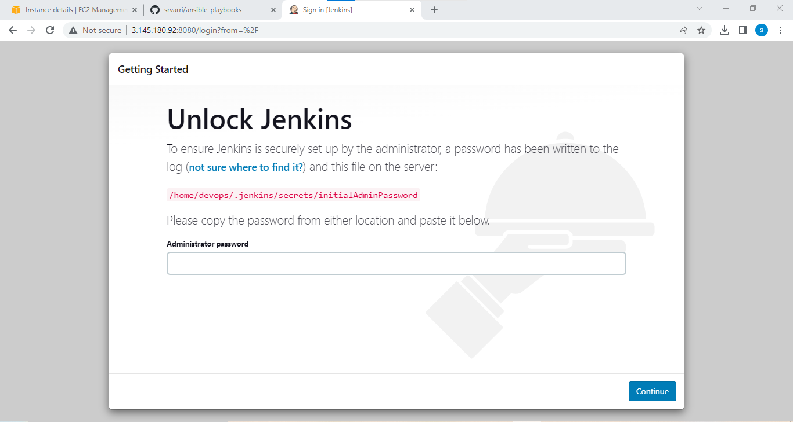

* Deploying jenkins war file on ubuntu(manually):
-------------------------------------------------
  * `sudo apt update`
  * `sudo apt install openjdk-11-jdk -y`
  * `wget https://updates.jenkins.io/download/war/2.384/jenkins.war`
  * we want to run jenkins application ,we need `jenkins service` file `sudo vi /etc/systemd/system/jenkins.service`
  * after then start service `sudo systemctl restart jenkins.service`
  * Deploying jenkins war file on remote machines using `ansible-playbook:`
--------------------------------------------------------
  * update and openjdk-11 installing: we want install jenkins need java, jenkins is a Java web application

    *  used `apt` module in ansible-playbook for `Update the repository cache and installing java-11`
      * - name: Update the repository cache and installing java
          apt:
            name: openjdk-11-jdk
            state: present
            update_cache: yes

    *  used `get_url` module in ansible-playbook for Downloading jenkins war file in `/home/devops`      
      * - name: Downloading jenkins war file
          get_url:
            url: https://updates.jenkins.io/download/war/2.384/jenkins.war
            dest: /home/devops/

    * used `copy` module in ansible-playbook for `copy the jenkins service file` in remote machine location `/etc/systemd/system/jenkins.service`
       * - name: Copying the jenkins service file to remote machine
           copy:
            src: jenkins.service
            dest: /etc/systemd/system/jenkins.service 

    * used systemd module in ansible-playbook for restart the `jenkins` service  
        * - name: restart the jenkins service
            systemd:
              state: restarted
              daemon_reload: yes
              name: jenkins.service  


* jenkins.yaml
------------------------------------------------------
* ```
     --- 
- name: install the jenkins 
  hosts: all 
  become: yes 
  tasks: 
    - name: install openjdk11 
      apt: 
        name: openjdk-11-jdk 
        update_cache: yes 
        state: present
    - name: download the wget url 
      get_url:
        url: https://updates.jenkins.io/download/war/2.384/jenkins.war 
        dest: /home/devops
        mode: "777"
    - name: create service file
      copy:
        src: jenkins.srvice 
        dest: /etc/systemd/system/jenkins.service
    - name: restart the jenkins service
      systemd:
        state: restarted
        daemon_reload: yes
        name: jenkins.service
----
*          